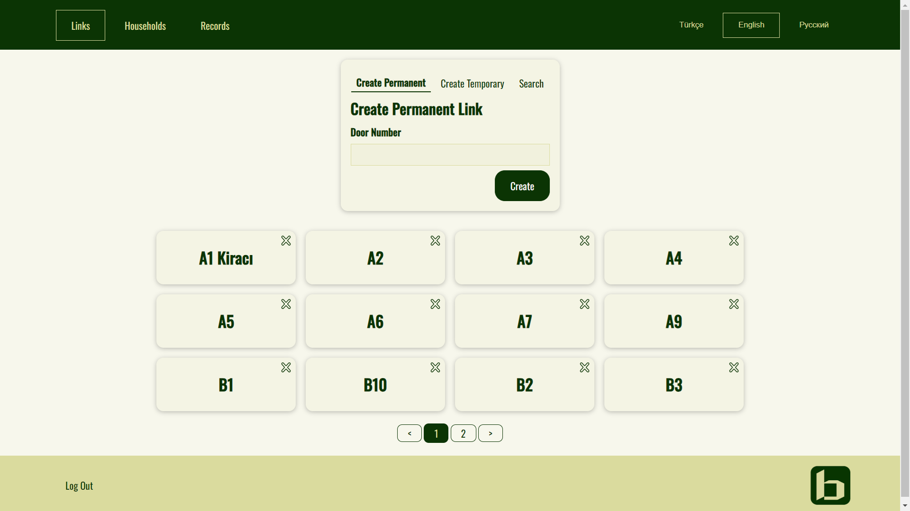

# bKapi -remote

## Screenshots





## Technologies Used

- React
- TypeScript
- React Hook Form
- Redux Toolkit
- react-i18next
- usehooks-ts
- [Bınak React Components](https://github.com/sDenizOzturk/binak-react-components)

## Live URL For Test

https://antasya-remote.bkapi.site/permanent/1600x5ts7f

## Getting started

- Clone the repository

```
git clone https://github.com/sDenizOzturk/bKapi-remote.git
```

- Install dependencies

```
cd bKapi-remote
npm install
```

- Build and run the project

```
npm run dev
```

Navigate to `http://localhost:5173`
